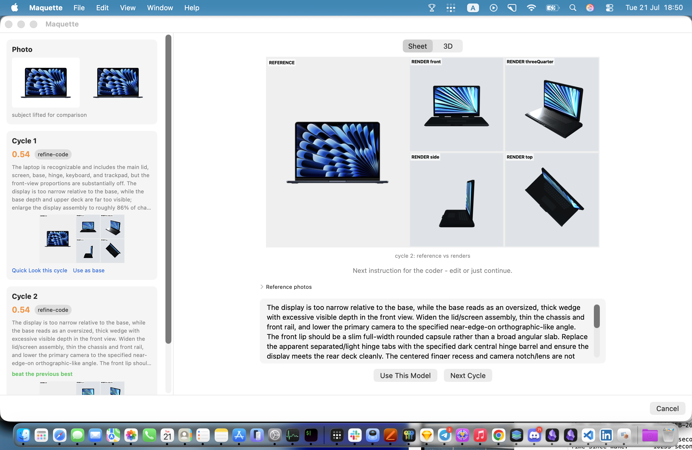
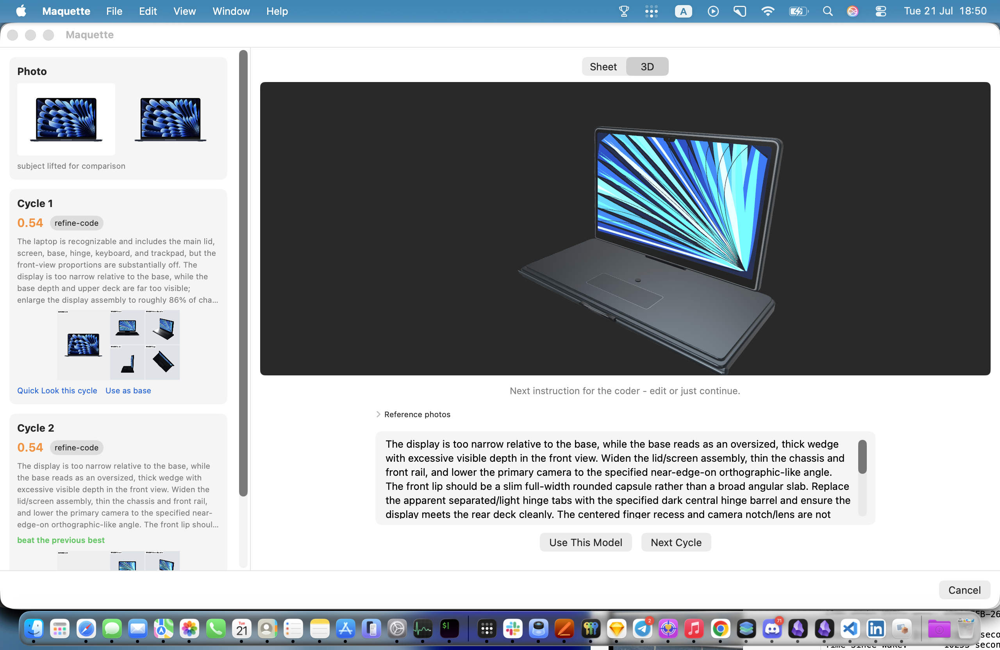
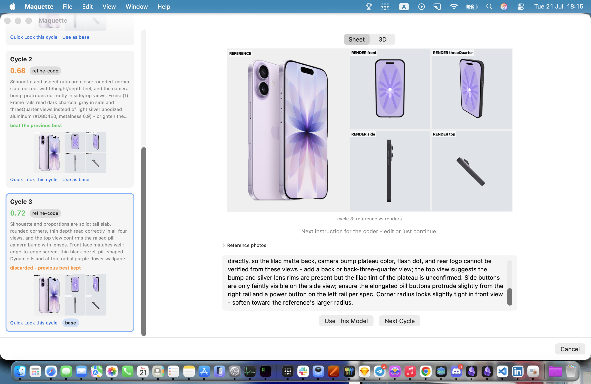
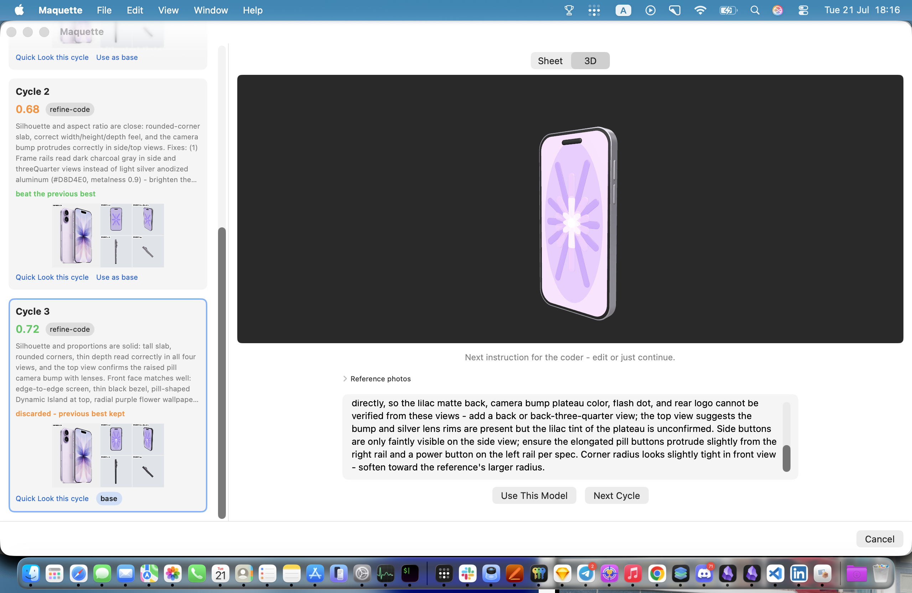

# Maquette

Drop a photo, get a sculpted 3D model.

Site (live 3D models, the sculpt-loop timeline): [maquette.nhannht.io.vn](https://maquette.nhannht.io.vn)

A coder LLM writes procedural Three.js geometry from your photo. A built-in
renderer screenshots it from four angles. A vision LLM compares the renders
against the photo, scores them, and tells the coder what to fix. The loop
repeats until the model looks right - and you can grab the wheel at every
gate, or let it run on autopilot. Out come `model.glb` and `model.usdz`,
ready for Blender, Unity, the web, or AR Quick Look on your iPhone.

Bring your own key. Any OpenAI-compatible endpoint works - OpenRouter,
OpenAI, Anthropic, Moonshot, or a local Ollama / LM Studio with no key at
all. The whole validation sweep that shipped this app cost under $0.10.





Another run, this time an iPhone - the judge climbs from 0.68 to 0.72
across cycles, and the losing challenger is discarded so the best model
always wins:





The exported result models (`.usdz` - open them in AR Quick Look) live in
[`showcase/`](showcase/).

## How it works

```
photo -> subject lift (Apple Vision, on-device)
      -> recognize: suggested plain-language build brief
         [GATE 1: you edit or accept - intent beyond the photo enters here]
      -> spec JSON compiled from photo + brief (internal)
      -> Three.js factory code            (coder slot)
      -> render + 4 screenshots           (bundled three.js, offline WKWebView)
      -> score + critique + pairwise gate (vision slot)
         [GATE 2: edit the next instruction, or autopilot]
      -> loop until accepted or capped
      -> best-scoring cycle -> GLB + USDZ -> AR Quick Look
```

Design choices that matter:

- **Two model slots, zero lock-in.** Coder and vision are independent slots
  pointed at any OpenAI-compatible endpoint. The model picker fetches the
  endpoint's live catalog, and a one-click "Cheapest" default picks an
  image-capable judge and a code-leaning coder for you.
- **Keys live in the macOS Keychain.** Never in files, UserDefaults, or logs.
- **The renderer is fully offline.** three.js r185 is bundled and served over
  a custom URL scheme; the sculpt page makes zero network requests, so the
  only thing your key ever does is talk to the endpoint you chose.
- **The best cycle wins, not the last.** LLM sculpting hill-climbs and
  regresses; runs keep, export, and report their best-scoring cycle.
- **Nothing is a dead end.** Every cycle stays exportable with its own
  GLB/USDZ and Quick Look, "Use as base" promotes any cycle to incumbent, and
  Keep Refining resumes a finished run - new cycles must beat the incumbent
  in a pairwise judgment to take over.
- **Intent goes beyond the photo.** Type "the box opens, a pair of earbuds
  sits inside" at the brief gate and the judge scores the interior against
  your brief instead of punishing it for not appearing in the photo.

## Install

Apple Silicon, macOS 14+. The app is signed with a Developer ID and
notarized by Apple.

```
brew install --cask nhannht/tap/maquette
```

Or grab the notarized DMG from
[Releases](https://github.com/nhannht/maquette/releases).

## Build from source

Requires macOS 14+ and Xcode command line tools.

```
git clone https://github.com/nhannht/maquette.git
cd maquette
./build.sh            # swift build + stable code signature (see note below)
.build/debug/MaquetteApp
```

In Settings, point the coder and vision slots at your endpoint, pick models
(or hit Cheapest), paste your key, and drop a photo. Clean, single-object
photos on quiet backgrounds sculpt best.

`build.sh` signs with your Apple Development certificate if one exists so the
Keychain's "Always Allow" sticks across rebuilds; without one it falls back
to plain `swift build` behavior. `./build.sh app` additionally wraps the
binary in a proper `Maquette.app` (Dock icon, Spotlight) and installs it to
`/Applications`. `swift test` runs the 53-test suite.

## CLI

Everything the app does, headless:

```
maquette-cli set-key <coder|vision>
maquette-cli render-test [--out DIR]
maquette-cli export <factory.js> [--out DIR]
maquette-cli sculpt <photo> --out DIR
    [--coder-model ID] [--vision-model ID]
    [--coder-endpoint URL] [--vision-endpoint URL]
    [--cycles N] [--threshold X] [--coder-text-only]
    [--coder-thinking-cap N] [--vision-thinking-cap N]
    [--intent TEXT] [--spec-file PATH]
```

Every cycle writes its artifacts (factory.js, renders, comparison sheet,
review.json) under `--out`, so you can audit exactly what the models did.

## Honest numbers

On the earbuds-case benchmark, `qwen3-coder` + `qwen3-vl-30b` through
OpenRouter accepted at 0.78 in one cycle for about $0.002. Judge scores on
identical inputs have ranged 0.65 to 0.84 across runs: treat the score as a
compass, not a caliper. That is exactly why the export-any-cycle and
human-gate features exist.

Known limits: single objects only (no characters or anatomy for now), and
multi-object reference photos confuse the loop - crop to one subject first.

## Credits

- The core idea - an LLM sculpting procedural Three.js against a reference
  image - comes from [img2threejs](https://github.com/hoainho/img2threejs) by
  hoainho (MIT). Maquette industrializes it into a native, BYOK, judged loop.
- [three.js](https://github.com/mrdoob/three.js) (MIT), vendored r185 core
  plus GLTFExporter, USDZExporter, and fflate.

## License

MIT
